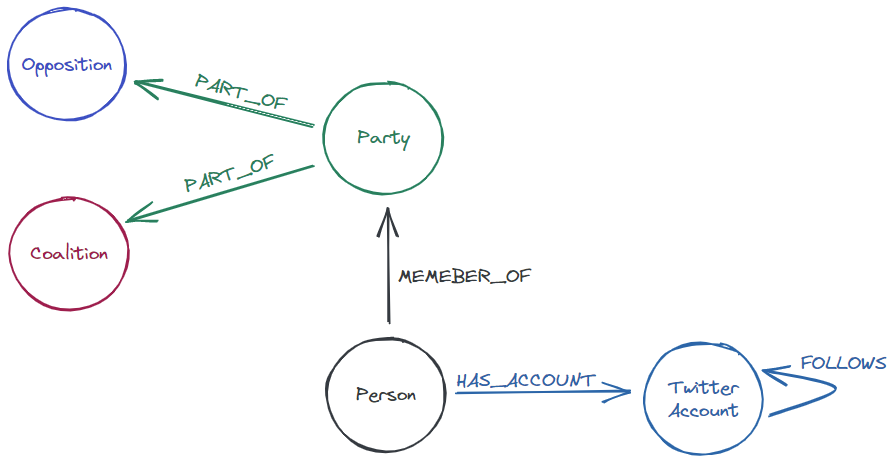

# Slovenian politics on Twitter

This graph contains Twitter accounts of slovenian members of the national assembly their following and their followers.

Schema of the graph:



To import the graph into Neo4j run the following query.

```cypher
CALL apoc.cypher.runSchemaFile("file:///playground/slovenian-politics-on-twitter/graph/schema.cypher");
CALL apoc.cypher.runFile("file:///playground/slovenian-politics-on-twitter/graph/import.cypher");
```

## pt.1 - basic exploration with NeoDash

You can explore the graph via Neo4j browser or NeoDash tool.
To use NeoDash go to http://neodash.graphapp.io, connect to the Neo4j db and load the `pt1-dashboard.json` dashboard.

If you wish to run "bare" queries, they are available in the `pt1-neo-dash.cypher` file.

